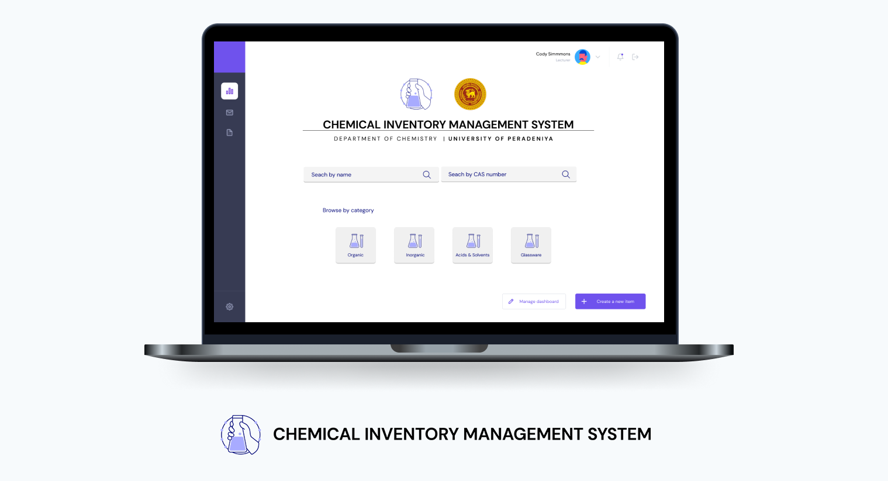

<p align="center">
    
</p>
<h1 align="center"> Chemical Inventory Management System </h1> <br>




# Frontend
React SPA 
```
cd cims-frontend

npm start
```

# Backend 

Backend repo [here](http://github.com/tharinduRe/cims-rest-api)

```
git clone http://github.com/tharinduRe/cims-rest-api.git

mvn springboot:run
```
# Deploy

```
cd deploy

./build-back
./build-front

docker-compose up
```